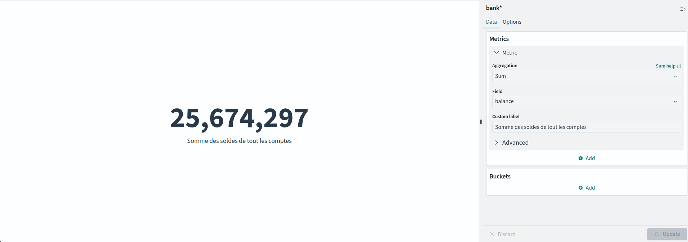
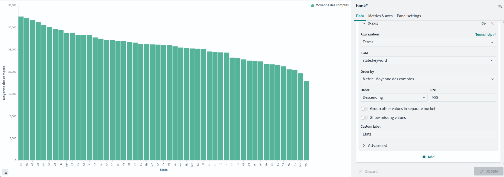
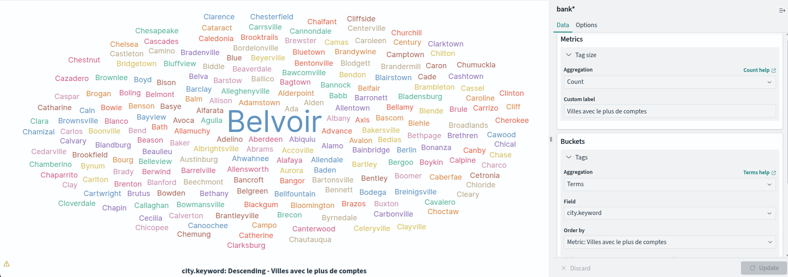
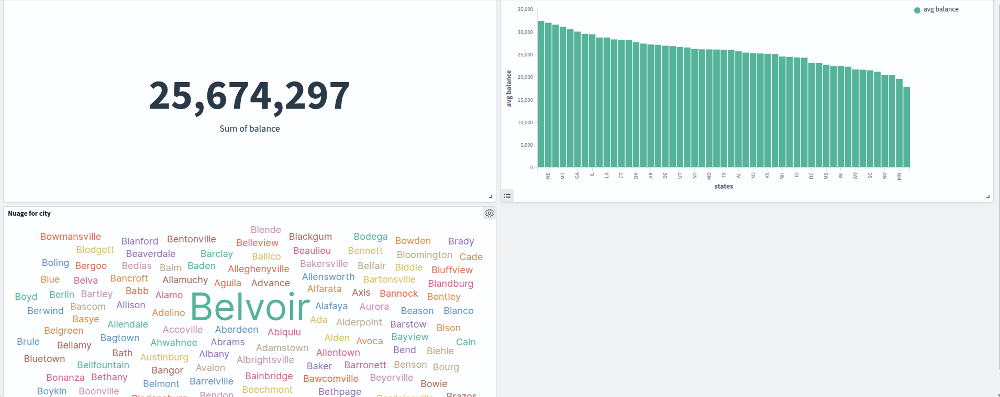
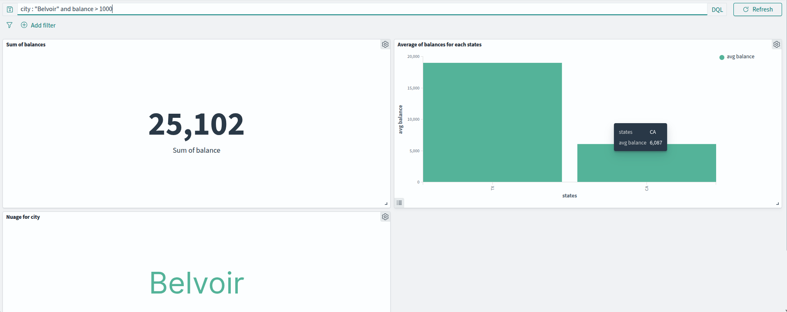
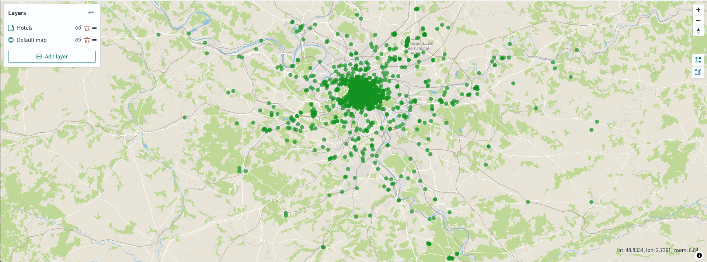

# Partie 1 - Gestion de données simples
### INDEX AND UPDATE API
- (Question) Après avoir étudié la structure d’un document, ajouter un nouveau compte dont l’ID est 10001

PUT bank/_create/10001
{
  "account_number": 10001,
  "balance": 1,
  "firstname": "Lilian",
  "lastname": "Laure",
  "age": 22,
  "gender": "M",
  "address": "1 rue de rue",
  "city": "TKT",
  "state": "VAR",
  "employer": "non",
  "email": "mail@mail.mail"
}

- (Question) Mettre à jour le compte précédent en modifiant l’adresse

POST bank/_update/10001
{
  "doc": {
    "address": "2 rue de rue",
    "city": "TKTKT"
  }
}

### DELETE API
- (Question) Supprimer le compte précédemment créé

DELETE bank/_doc/10001

- (Question) Supprimer tous les comptes de la ville de Nicholson (Utiliser _delete_by_query)

POST bank/_delete_by_query
{
  "query": {
    "term": { "city.keyword": "Nicholson" }
  }
}

### GET API
- (Question) Obtenir le compte dont l’ID est 2

GET bank/_doc/2

- (Question) Idem mais récupérer uniquement le source (champs _source)

GET bank/_source/2

- (Question) Idem mais en ne sélectionnant que le nom et le prénom (firstname, lastname)

GET bank/_source/2?_source=firstname,lastname

### SEARCH API

- (Question) Retrouver tous les comptes

GET bank/_search
{
  "query": { "match_all": {} }
}

- (Question) Retrouver tous les comptes dont la ville (champs city) est Belvoir

GET bank/_search
{
  "query": {
    "term": { "city.keyword": "Belvoir" }
  }
}

- (Question) Retrouver tous les comptes dont la ville (champs city) est Belvoir ET l’employeur Xurban

GET bank/_search
{
  "query": {
    "bool": {
      "must": [
        { "term": { "city.keyword": "Belvoir" } },
        { "term": { "employer.keyword": "Xurban" } }
      ]
    }
  }
}

### Visualisation des données avec OpenSearch Dashboards

- (Question) Métrique affichant la somme des soldes de tous les comptes. Sauver le graphique.
  
  

- (Question) Graphique barre affichant la moyenne des soldes (champ balance) selon l’état (champ state). Sauver le graphique.
  
  

- (Question) Nuage de mots représentant les villes dans lesquelles il y a le plus de comptes. Sauver le graphique.
  
  

- (Question) Réaliser un tableau de bord regroupant les 3 visuels précédents.

  

- (Question) Exécuter une requête dans la barre de recherche situé au dessus et remarquez que les visuels se mettent automatiquement à jour.

  

# Partie 2 - Gestion de documents textuels

### SEARCH API

- (Question) Rechercher les documents contenant le terme KING dans les champs text_entry OU playname. Accordez deux fois plus d’importance aux documents qui contiennent le terme dans le champ play_name (astuce : KING^2).

GET shakespeare/_search?q=play_name:KING^2 OR text_entry:KING

- (Question) Rechercher les documents où l’orateur (champ speaker) CAESAR parle de Brutus (champ text_entry)

GET shakespeare/_search?q=speaker:CAESAR AND text_entry:Brutus

- (Question) Rechercher les documents où l’orateur(champ speaker) CAESAR ne parle PAS de Brutus (champ text_entry)

GET shakespeare/_search?q=speaker:CAESAR AND NOT text_entry:Brutus

- (Question) Rechercher les documents répondant à la requête `caesar brutus calpurnia`

GET shakespeare/_search?q=caesar brutus calpurnia

- (Question) Selon vous, pourquoi le quatrième document, qui contient tous les termes, n’est pas en première position ?

La requête est traitée comme un `caesar OR brutus OR calpurnia`, et donc l'affichage dépend des paramètres de la recherche, donc même si il y a les 3, ils seront interprété différamment

- (Question) Modifier la requête pour que seul le quatrième document réponde.

GET shakespeare/_search?q=caesar AND brutus AND calpurnia

- (Question) Rechercher les documents répondant à la requête cesar (la faute est volontaire)

GET shakespeare/_search?q=cesar

- (Question) Pourquoi aucun document ne répond ?

Aucun doc ne réponds car il y a une faute

- (Question) Essayez maintenant avec la requête cesar~ 

GET shakespeare/_search?q=cesar~

- (Question) En déduire le rôle de l’opérateur ~

La recherche est étendue pour trouver des termes similaires.

### AGGREGATION API

- (Question) Trouver le nombre total de pièces (champ play_name)

POST shakespeare/_search?q=*
{
  "size": 0,
  "aggs": {
    "nb_pieces": {
      "cardinality": { "field": "play_name.keyword" }
    }
  }
}

- (Question) En une requête, calculer le nombre de lignes (champ line_id) pour chaque pièce (champ play_name)

POST shakespeare/_search
{
  "size": 0,
  "aggs": {
    "par_piece": {
      "terms": {
        "field": "play_name.keyword"
      },
      "aggs": {
        "nb_lignes": { 
          "value_count": { "field": "line_id" } 
        }
      }
    }
  }
}

# Partie 3 - Recherches sémantiques

group_id : m2rppZoBYKbjyQMtZGfK
task_id : n2rqpZoBYKbjyQMtQGdJ
model_id : o2rqpZoBYKbjyQMtTWfj

- (Question) Rechercher "Usage of artificial intelligence in medicine". Afficher les champs headline, short_description, date et link.

GET news/_search?size=10
{
  "query": {
    "neural": {
      "text_embedding": {
        "query_text": "Usage of artificial intelligence in medicine",
        "model_id": "o2rqpZoBYKbjyQMtTWfj",
        "k": 10
      }
    }
  },
  "fields": ["headline, short_description, date,link"],
  "_source": false
}

Résultat de la requete :

```json
{
  "took": 1493,
  "timed_out": false,
  "_shards": {
    "total": 1,
    "successful": 1,
    "skipped": 0,
    "failed": 0
  },
  "hits": {
    "total": {
      "value": 30,
      "relation": "eq"
    },
    "max_score": 0.45529795,
    "hits": [
      {
        "_index": "news",
        "_id": "https://www.huffingtonpost.com/entry/medical-professionals-fact-check-greys-anatomy-sex-scenes_us_5af1f004e4b041fd2d2bcd59",
        "_score": 0.45529795
      },
      {
        "_index": "news",
        "_id": "https://www.huffpost.com/entry/cbp-detained-migrants-flu-vaccinations_n_5d5c62abe4b0f667ed69e9c4",
        "_score": 0.44563347
      },
      {
        "_index": "news",
        "_id": "https://www.huffpost.com/entry/pediatricians-racism_n_626fcfbde4b029505df470fc",
        "_score": 0.4383204
      },
      {
        "_index": "news",
        "_id": "https://www.huffpost.com/entry/sanjay-gupta-trump-health-questions_n_5f7aa25dc5b64cf6a25273b4",
        "_score": 0.43696985
      },
      {
        "_index": "news",
        "_id": "https://www.huffpost.com/entry/cdc-expert-axed-china_n_5e77dd7bc5b63c3b6492aba3",
        "_score": 0.42713836
      },
      {
        "_index": "news",
        "_id": "https://www.huffpost.com/entry/how-to-know-doctor-is-a-quack_l_5f285ec7c5b6a34284be2d44",
        "_score": 0.42468795
      },
      {
        "_index": "news",
        "_id": "https://www.huffpost.com/entry/tokyo-olympics-to-allow-limit-of-10000-local-fans-in-venues_n_60d07c2ce4b0dd017429d035",
        "_score": 0.42302868
      },
      {
        "_index": "news",
        "_id": "https://www.huffingtonpost.com/entry/catholic-hospitals-refuse-to-treat_us_5b06c82fe4b05f0fc8458db3",
        "_score": 0.42145663
      },
      {
        "_index": "news",
        "_id": "https://www.huffpost.com/entry/how-quack-doctors-and-powerful-gop-operatives-spread-misinformation-to-millions_n_5f208048c5b66859f1f33148",
        "_score": 0.4181326
      },
      {
        "_index": "news",
        "_id": "https://www.huffpost.com/entry/covid-19-antiviral-pill-biden_n_60cbf90de4b01af0c26e5662",
        "_score": 0.41806892
      }
    ]
  }
}
```

- (Question) Rechercher les articles similaires à celui-ci https://www.huffpost.com/entry/15-comedy-documentaries-worth-watching-on-netflix-photos_n_1619966. Copier / coller le début de l'article dans la requête.

```http
GET news/_search?size=10
{
  "query": {
    "neural": {
      "text_embedding": {
        "query_text": "Netflix, to its credit, has a phenomenal archive of documentaries available to watch whenever you want. Even better, they have some really interesting comedy-related documentaries available to watch whenever you want. These movies take a poignant look at such comedy legends as Bill Hicks, Conan O'Brien, Woody Allen, Joan Rivers and more and make for great summer movie marathon-ing.With that in mind, and because going to the beach is totally overrated, we put together a list of 15 of the best comedy documentaries available on Netflix Instant. So, what are you waiting for? Plant yourself on the couch, crank up that A.C. and get to watching!",
        "model_id": "o2rqpZoBYKbjyQMtTWfj",
        "k": 10
      }
    }
  },
  "fields": ["headline, short_description, date,link"],
  "_source": false
}
```

Résultat de la requete :

```json
{
  "took": 2074,
  "timed_out": false,
  "_shards": {
    "total": 1,
    "successful": 1,
    "skipped": 0,
    "failed": 0
  },
  "hits": {
    "total": {
      "value": 30,
      "relation": "eq"
    },
    "max_score": 0.50964284,
    "hits": [
      {
        "_index": "news",
        "_id": "https://www.huffingtonpost.com/entry/good-movies-netflix_us_5af98954e4b0e57cd9fbb43f",
        "_score": 0.50964284
      },
      {
        "_index": "news",
        "_id": "https://www.huffpost.com/entry/good-movies-netflix_l_5c740a76e4b00eed08376b23",
        "_score": 0.50932616
      },
      {
        "_index": "news",
        "_id": "https://www.huffpost.com/entry/movies-leaving-netflix-december_l_5fcfb3a7c5b619bc4c36534d",
        "_score": 0.4993825
      },
      {
        "_index": "news",
        "_id": "https://www.huffingtonpost.com/entry/queer-eye-season-two-dates_us_5b06dadee4b07c4ea10605d8",
        "_score": 0.48768482
      },
      {
        "_index": "news",
        "_id": "https://www.huffpost.com/entry/best-netflix-stream-the-oa_l_5c93ca8ae4b088a7df0569a0",
        "_score": 0.48148707
      },
      {
        "_index": "news",
        "_id": "https://www.huffpost.com/entry/good-movies-netflix_n_5c0e8085e4b06484c9fcce8f",
        "_score": 0.48082238
      },
      {
        "_index": "news",
        "_id": "https://www.huffingtonpost.com/entry/amazon-prime-what-to-watch_us_5aeb7198e4b041fd2d248176",
        "_score": 0.4788296
      },
      {
        "_index": "news",
        "_id": "https://www.huffpost.com/entry/netflix-films-2020-good-reviews_l_5f69fd1bc5b655acbc70111d",
        "_score": 0.4785452
      },
      {
        "_index": "news",
        "_id": "https://www.huffpost.com/entry/new-movies-shows-netflix-july-2022_l_62b35d36e4b0cdccbe65feec",
        "_score": 0.47538525
      },
      {
        "_index": "news",
        "_id": "https://www.huffpost.com/entry/new-on-netflix-january-2022_l_61bd226ae4b04b42ab5fce98",
        "_score": 0.47538525
      }
    ]
  }
}
```

# Partie 4 - Pour aller plus loin : Logstach

- (Question) Développez un tableau de bord sur ces données. Ce tableau devra comporter une carte géographique des hôtels classés en fonction de leur nombre d’étoiles.

  
